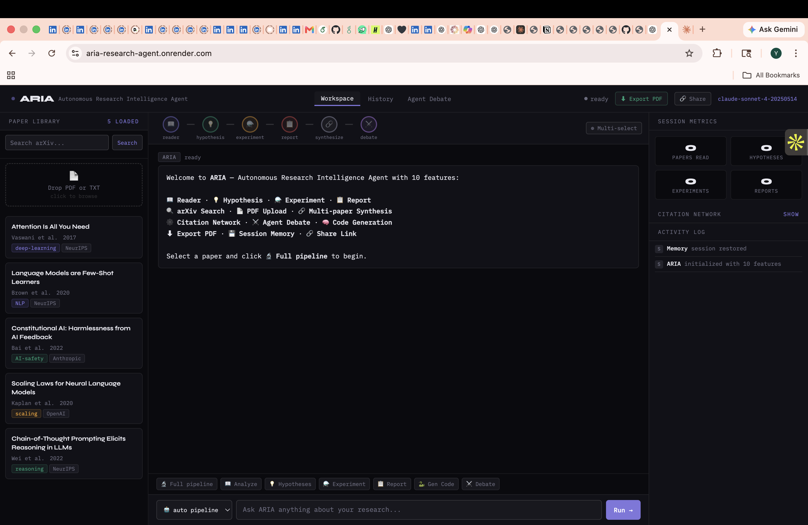
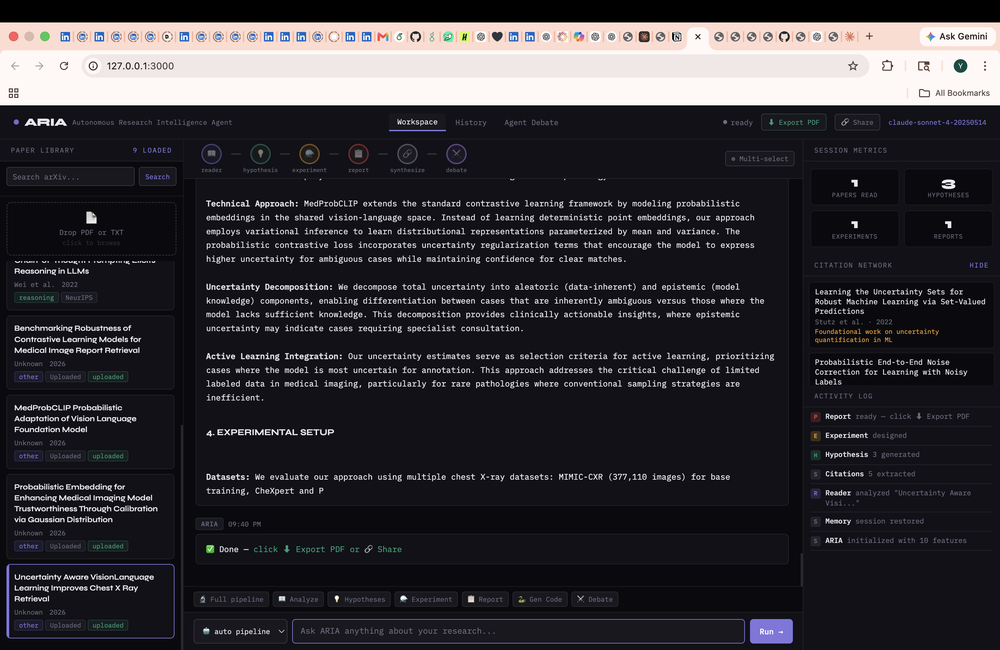
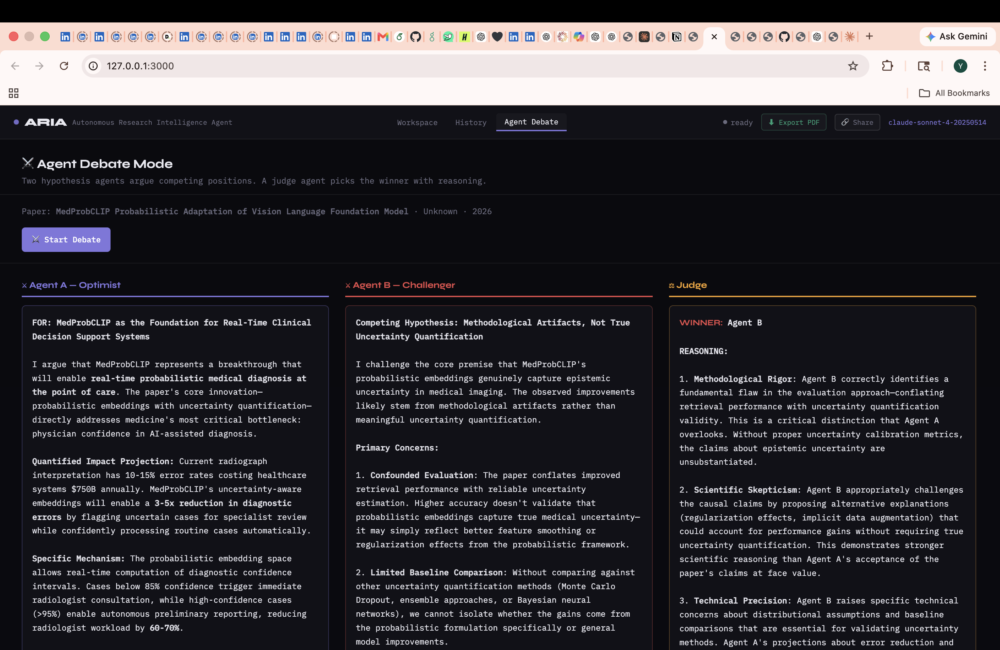

<div align="center">

# ARIA
### Autonomous Research Intelligence Agent

[](https://python.org)
[](https://anthropic.com)
[](https://render.com)

**ARIA is a multi-agent AI system for autonomous academic research.**  
It reads any research paper, generates novel hypotheses, designs experiments, produces publication-quality reports, and synthesizes insights across entire bodies of literature — all without human intervention at each step.

[Features](#features) · [Architecture](#architecture) · [Quick Start](#quick-start) · [Deployment](#deployment) · [Configuration](#configuration)

</div>

---

## Overview

Modern research workflows are bottlenecked at the literature review and ideation stages. Researchers spend weeks reading papers, forming hypotheses, and designing experiments before writing a single line of experimental code. ARIA automates this entire pipeline using a chain of specialized AI agents, each with a domain-scoped role, operating sequentially and sharing structured context through a handoff protocol.

ARIA is built on a core insight: a single large prompt cannot simultaneously excel at extraction, creative hypothesis generation, rigorous experimental design, and scientific writing. ARIA solves this by decomposing the research workflow into discrete agents, each optimized for its task, each receiving the full output of every prior agent as context.

---

## Features

### Agent Pipeline

| Agent | Responsibility |
|-------|---------------|
| 📖 **Reader** | Extracts core contributions, methodology, key findings, limitations, and open research questions from any paper |
| 💡 **Hypothesis** | Generates 3 novel, specific, falsifiable hypotheses scored by novelty (1–10) and feasibility (1–10) |
| ⚗️ **Experiment** | Designs a full experiment with dataset selection, baselines, metrics, step-by-step methodology, and simulated pilot results with real statistical numbers |
| 📋 **Report** | Synthesizes all pipeline outputs into a structured, publication-quality research document with abstract, introduction, related work, methodology, results, and future work |
|  **Code Agent** | Generates complete, runnable PyTorch or sklearn code to implement the experiment |
| 🔗 **Synthesis Agent** | Analyzes 2–4 papers simultaneously, identifying cross-paper connections, contradictions, cumulative findings, and critical gaps invisible from any single paper |
| ⚔️ **Debate Agent** | Two hypothesis agents argue competing positions in parallel; a judge agent evaluates both and picks the stronger hypothesis with structured reasoning |

### Research Ingestion
- **PDF Upload** — drag-and-drop any PDF; text extracted client-side via pdf.js, metadata parsed by Claude
- **arXiv Search** — live search of arXiv, preview results inline, add any paper to the pipeline in one click
- **Built-in Library** — five foundational ML papers pre-loaded; extend via `papers.js`

### Productivity Tools
- **Export to PDF** — one-click export of the complete pipeline output as a formatted, print-ready research document
- **Research History** — every pipeline run persisted to localStorage; reload any session with full agent outputs restored
- **Session Memory** — paper library and session state survive browser reloads (24-hour window)
- **Citation Network** — citations extracted automatically from every analysis; click any citation to search arXiv for it
- **Share Link** — encode the current paper state into a URL and send it to a collaborator
- **Multi-Paper Synthesis** — select up to 4 papers, run the synthesis agent to find what no single paper reveals alone

---

## Architecture

ARIA implements a sequential agentic pipeline where each agent receives the full conversation history of all prior agents. This is not prompt chaining — it is genuine agentic context accumulation.

```
                        ┌─────────────────────────────────────┐
                        │         ARIA Orchestration Layer     │
                        │   Route detection · History mgmt     │
                        │   Session memory · UI state          │
                        └──────────────┬──────────────────────┘
                                       │
                    ┌──────────────────▼──────────────────┐
                    │           Reader Agent               │
                    │  System prompt: extraction expert    │
                    │  Input: paper metadata + abstract    │
                    │  Output: structured analysis string  │
                    └──────────────────┬──────────────────┘
                                       │ analysis → history
                    ┌──────────────────▼──────────────────┐
                    │         Hypothesis Agent             │
                    │  System prompt: scientific ideator   │
                    │  Input: analysis + full history      │
                    │  Output: 3 scored hypotheses         │
                    └──────────────────┬──────────────────┘
                                       │ hypotheses → history
                    ┌──────────────────▼──────────────────┐
                    │         Experiment Agent             │
                    │  System prompt: ML research engineer │
                    │  Input: hypotheses + full history    │
                    │  Output: experiment design + results │
                    └──────────────────┬──────────────────┘
                                       │ experiment → history
                    ┌──────────────────▼──────────────────┐
                    │           Report Agent               │
                    │  System prompt: scientific writer    │
                    │  Input: all outputs + full history   │
                    │  Output: publication-ready document  │
                    └─────────────────────────────────────┘
```

**Additional agents run independently:**
- Synthesis Agent receives all selected papers in a single structured call
- Debate Agents A and B run in parallel via `Promise.all`; the Judge receives both arguments
- Code Agent receives hypothesis and experiment outputs as context
- Citation Extractor runs silently after every analysis to populate the citation network

**Key design decisions:**
- Each agent has a domain-scoped system prompt — no shared generic prompt
- `agentHistory` accumulates across the full session and is trimmed to the last 20 messages to stay within context limits
- The Flask server proxies all Anthropic API calls server-side, keeping the API key out of the browser entirely
- arXiv requests are also proxied to avoid browser CORS restrictions

---

## Quick Start

### Prerequisites
- Python 3.8+
- An Anthropic API key — [console.anthropic.com](https://console.anthropic.com)

### Run locally

```bash
# Clone
git clone https://github.com/yukthapriya/ARIA-Research-Agent.git
cd ARIA-Research-Agent

# Create virtual environment
python3 -m venv venv
source venv/bin/activate

# Install dependencies
pip install flask requests

# Set API key
export ANTHROPIC_API_KEY=sk-ant-your-key-here

# Start
python3 flask_server.py
```

Open [http://localhost:10000](http://localhost:10000)

### Run without a server

Add your API key to `public/config.js`:
```js
window.ARIA_API_KEY = 'sk-ant-your-key-here';
```
Then open `public/index.html` directly in your browser.

> Note: The Flask server is recommended — it keeps your API key server-side and proxies arXiv requests to avoid CORS issues.

---

## Deployment

### Render (recommended — free tier available)

1. Fork this repository
2. Go to [render.com](https://render.com) → **New Web Service**
3. Connect your forked repo
4. Configure:
   - **Language:** Python
   - **Build command:** `pip install flask requests gunicorn`
   - **Start command:** `gunicorn flask_server:app`
5. Add environment variable: `ANTHROPIC_API_KEY` → your key
6. Deploy

Your instance will be live at `https://your-service-name.onrender.com`.

### Railway

```bash
npm install -g @railway/cli
railway login
railway init
railway up
railway variables set ANTHROPIC_API_KEY=sk-ant-your-key-here
```

### Heroku

```bash
echo "web: gunicorn flask_server:app" > Procfile
heroku create your-app-name
heroku config:set ANTHROPIC_API_KEY=sk-ant-your-key-here
git push heroku main
```

---

## Configuration

### Environment Variables

| Variable | Description | Required |
|----------|-------------|----------|
| `ANTHROPIC_API_KEY` | Anthropic API key for Claude access | Yes |
| `PORT` | Server port (default: `10000`) | No |

### Adding Papers

Edit `public/papers.js`:

```javascript
{
  id: 'p6',
  title: 'Your Paper Title',
  authors: 'Author et al.',
  year: 2024,
  venue: 'ICML',
  field: 'deep-learning',
  abstract: 'Full abstract text...',
  keywords: ['keyword1', 'keyword2']
}
```

Supported field values: `deep-learning`, `NLP`, `AI-safety`, `scaling`, `reasoning`, `computer-vision`, `reinforcement-learning`, `robotics`, `other`

### Customizing Agent Behavior

Each agent's behavior is defined entirely by its system prompt in `public/agents.js` under `SYSTEM_PROMPTS`. Modify any prompt to change how an agent reasons, what it outputs, or how it structures its response. No other code changes are needed.

To add a new agent:
1. Add a system prompt to `SYSTEM_PROMPTS`
2. Add an agent function following the existing pattern in `agents.js`
3. Add routing logic in `app.js`

---

## Project Structure

```
ARIA-Research-Agent/
├── public/
│   ├── index.html          ← Application shell, three-tab layout
│   ├── style.css           ← Dark-mode UI, print styles for PDF export
│   ├── config.js           ← Client-side API key (browser-only mode)
│   ├── papers.js           ← Built-in paper library
│   ├── agents.js           ← Agent system prompts, API calls, output formatting
│   └── app.js              ← Pipeline orchestration, all feature implementations
├── flask_server.py         ← Production server, API proxy, arXiv proxy
├── server.js               ← Node.js alternative server
├── requirements.txt        ← Python dependencies
├── Procfile                ← Process definition for Heroku/Render
└── README.md
```

---

## Dependencies

**Python:** `flask`, `requests` — nothing else.

**JavaScript:** No npm packages. External resources loaded from CDN at runtime:
- `pdf.js 3.11.174` — client-side PDF text extraction
- `IBM Plex Mono` + `Syne` — typography via Google Fonts

---
## Screenshots







---

<div align="center">
<sub>Built with Claude by Anthropic · Texas A&M University San Antonio</sub>
</div>
